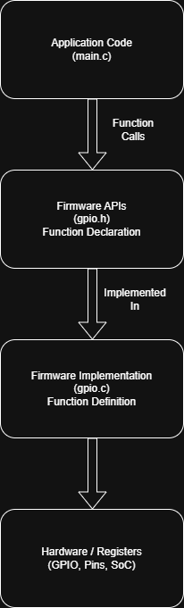
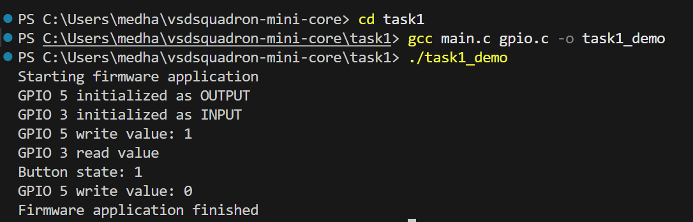

# Task 1: Firmware Foundations & Environment Setup

This task focuses on understanding the fundamentals of embedded firmware,
firmware libraries, and the importance of APIs in embedded systems.
A simple firmware-style C library was studied and executed to understand
how abstraction is used to separate application logic from low-level
implementation details.

## What is Embedded Firmware?

Embedded firmware is low-level software that runs directly on hardware
such as microcontrollers or System-on-Chip (SoC) devices. It acts as an
interface between the hardware and higher-level application logic.

Unlike application software, firmware is closely tied to the hardware.
It is responsible for initializing hardware, controlling peripherals,
and providing basic services such as input/output, timing, and communication.

## What is a Firmware Library?

A firmware library is a collection of reusable functions that provide
a clean and simple interface to interact with hardware components.
Instead of directly accessing hardware registers, application code
calls these library functions.

Firmware libraries hide hardware-specific details and allow developers
to focus on functionality rather than low-level implementation.
This makes code easier to maintain, reuse, and scale across projects.

## Why APIs are Important in Embedded Systems

APIs (Application Programming Interfaces) define how software components
interact with each other. In embedded systems, APIs allow application code
to use hardware features without knowing how they are implemented internally.

Using APIs improves code readability, reduces errors, and enables
hardware abstraction. If hardware changes, only the library implementation
needs to be updated while the application code remains unchanged.

## Understanding the Task 1 Lab Code

The Task 1 lab demonstrates a simple firmware-style library using C.

- `gpio.h` defines the public API by declaring function prototypes.
- `gpio.c` contains the implementation of the GPIO-related functions.
- `main.c` uses the GPIO API without knowing the internal implementation.

This structure reflects real embedded firmware design, where application
code relies on APIs while hardware-specific logic is isolated inside
library files.

## Compilation and Execution

